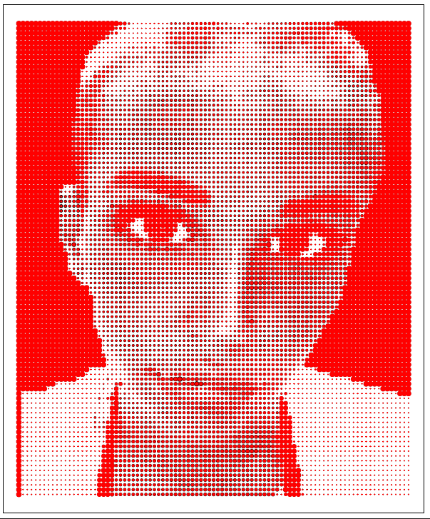

# The official collaborative halftoner package gallery 

Please add your graphics to gallery/graphics and use a simple markdown section below to give yourself attribution. Please use name your images using a prefix that includes your username to avoid filename conflicts. For cross-platform compatibility, display of images should not exceed 900 pixels on the x-axis and 1200 pixels on the y-axis. If you would like to share your code, please include it as a stand-alone script in the graphics directory named the same as your image but with a .R file extension. 

If you have suggestions for improving this gallery, please feel free to make a pull request. 

## Chris Marcum 

*Halftone of Self-Portrait by Photographer Jamie Colette Park (@colettepark on instagram)*

